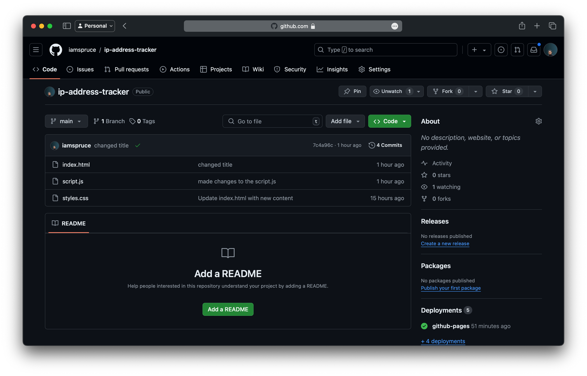

+++
title = "On Transparent Metagenomics"
date = 2026-07-01
description = "Invited talk at Imperial College London on Reproducible Metagenomics and a labour of love"
[taxonomies]
tags = ["reproducibility", "metagenomics"]
+++

## A Note on Terminology

The terminology used to describe microbial communities is diverse and often subject to debate. Common proposed definitions are:

<dl style="margin-left: 2cm;">
  <dt style="font-weight: bold; font-variant: small-caps;">Microbiota</dt>
  <dd>The assemblage of living microorganisms (bacteria, archaea, fungi, and viruses) present in a defined environment.</dd>

  <dt style="font-weight: bold; font-variant: small-caps;">Metagenome</dt>
  <dd>Strictly, the collection of genes and genomes from the members of a microbiota.</dd>

  <dt style="font-weight: bold; font-variant: small-caps;">Microbiome</dt>
  <dd>The entire ecosystem, encompassing the microbiota, their genomes, and the surrounding environmental conditions.</dd>
</dl>

While these biological distinctions are important, in the literature (and within this thesis) the terms *microbiome data* and
*metagenomic data* are frequently used interchangeably to refer to the high-throughput sequencing read count tables derived
from these communities, regardless of whether the underlying biological material was the organisms themselves or their
extracted genetic material. 

## Introduction

In an ideal world, every research project would be perfectly reproducible. That is, anyone should
be able to take the detailed description of your methods and reproduce your results, either with your data or with
their own data. Much has been written about reproducible research, and in fact the field of
[metascience](https://en.wikipedia.org/wiki/Metascience) itself is primarily concerned with reproducibility.
The concepts that I will describe here are *not new*. However, while the general ideas behind reproducible research are
broadly the same in every field, transparent and reproducible reporting in metagenomics requires substantially more effort.

Some recommended reading on reproducibility in general: 
- [The Turing Way: Guide for Reproducible Research](https://book.the-turing-way.org/reproducible-research/reproducible-research)
- [Reproducible Data Analysis Workflows](https://statsepi.substack.com/p/reproducible-data-analysis-workflows)
- [Ten Simple Rules for Reproducible Computational Research](https://journals.plos.org/ploscompbiol/article?id=10.1371/journal.pcbi.1003285)

The first resource is a particularly thorough introduction to reproducible data science.


In metascience, a distinction between reproducibility and replicability is often made. Reproducibility is whether
other scientists (including future you) are able to reproduce your analysis as-is, with your given data and code.
Reproducibility, therefore, is primarily a matter of good house-keeping. Replicability on the other hand is more of a scientific
concern. Are others able to find results that match yours in study populations other than the original study population?
Both reproducibility and replicability are important, but we'll start with reproducibility given that without reproducibility
your results cannot be replicable. Reproducibility is necessary but not sufficient for replicability.

## On Sampling Metagenomic Data

While the majority of this post will deal with *analysing and reporting* on metagenomic data, it is important to recognise
that metagenomic data is extracted from real biological samples. The physical act of sampling is inherently messy, and
often the stage which can most drastically alter study conclusions based on the decisions made. The journey to reproducible
research begins the moment you collect that sample, long before the data ever gets to a computer.


Documenting this step is critical and the [Genomic Standards Consortium](https://www.gensc.org/) has provided some guidance
on the appropriate information to document, see [Minimum Information about any (X) Sequence (MIxS) standard.](https://www.gensc.org/pages/standards-intro.html)

Consider the simple impact of storage, on two samples from the same individual. If sample `x` remains at room temperature
on a lab bench-top for two hours while sample `y` is immediately stored in a -80°C freezer, you may generate drastically
different microbial compositions. Differential degradation rates, sample lysis, as well as a host of other factors can
impact extraction and replication efficiency. No downstream bioinformatics pipeline, regardless of how sophisticated, can
magically recover information that is lost prior to sequencing.

## Bit-rot and the End of Things

Before I get to suggestions for a transparent metagenomic analysis workflow I need to point out that reproducibility is
only as good as your **available documentation.** If you have great documentation on your workflow, but absolutely nobody
can find it then unfortunately your study cannot be reproduced. I have lost track of the number of times I have searched
for detailed methods for a metagenomics manuscript only to be met with this:
<div style="border: 1px solid var(--site-line); border-radius: 6px; padding: 1.75rem 2rem; margin: 2rem 0; background: var(--site-surface);">
  <p class="eyebrow">Error 404</p>
  <p style="font-size: 2rem; line-height: 1.05; margin: 0.15rem 0 0.6rem; font-family: 'EB Garamond', Georgia, serif; font-weight: 700;">Page Not Found</p>
  <p style="margin: 0;">The page you are looking for might have been removed, had its name changed, or is temporarily unavailable.</p>
</div>


Often the links to the supplementary data maintained by the journals themselves point to moved or unavailable resources.
As an author, while this is not your fault, it is ultimately **your responsibility.** Therefore, rule number one of
transparent metagenomics is:

**Rule 1**

> You must have a permanent link to your detailed methods documentation that is attached directly to the manuscript and
> always points to the current documentation for said analysis. 

Ideally this would be located in the same place that your final analysis scripts are located, and the link to both of those
things is somewhat permanent. A good option for this is [zenodo](https://zenodo.org/).  See
[zenodo's github documentation](https://help.zenodo.org/docs/github/) for information on how to do this.  Zenodo,
will not only provide a [Digital Object Identifier (DOI)](https://www.doi.org/) that links directly to your chosen
repository, but will archive the version of your repository at the time you choose to publish on zenodo. The exact data
and code you used to generate your findings, will be permanently linked to a specific identifier that is not tied to
account names (which may change) or proprietary software enterprises.  GitHub is usually pretty
good at tracking account name changes, but sometimes it can still lead to dead links.  Now that we are in
agreement about having permanent documentation, you may be asking what it is you should document.

## Pipeline Pathways

At a minimum, the exact code you used for your analysis should be documented. However, metagenomic analyses typically
involve complex data cleaning and preparation before any actual analysis. The decisions made in the data processing
pipeline can **drastically** alter your final results. Every single one of the steps in the pipeline below has the potential
to alter the final results if different choices are made. Much like Gelman's [garden of forking paths](https://sites.stat.columbia.edu/gelman/research/unpublished/p_hacking.pdf),
although in this instance it is more like a forest of forking paths.

<figure id="pipeline-figure">
<div class="tufte-plot-container">
  <div class="tufte-plot-item">
    images/pipeline.svg
  </div>
</div>
<figcaption style="text-align:center;font-size:0.8rem;color:var(--site-muted);margin-top:0.6rem;">A simplified shotgun
metagenomics analysis pipeline. Dashed arrows indicate a phase transition.</figcaption>
</figure>

To complicate matters further, metagenomic analyses often depend on externally maintained resources for many steps in the
QC pipeline. For example, taxonomic classification often makes use of reference databases like [silva](https://www.arb-silva.de/)
or [greengenes](https://ngdc.cncb.ac.cn/databasecommons/database/id/3120) — for 16S rRNA sequencing. Thankfully,
all of these resources are typically versioned, and therefore you merely need to document the specific version of the
resource that you used.

 See [Salter, et al., 2014. Reagent and laboratory contamination can critically
impact sequence-based microbiome analyses. BMC Biol 12.](https://doi.org/10.1186/s12915-014-0087-z) 
For quality control and contaminant checking, it is not enough to just record the names and versions of software that you use.
Ideally you should report both the code that you used to identify contaminants, and the final list of contaminants so
that readers of your work can determine for themselves if your approach and its results are reasonable.

## Versions and the Beginning of Things

 It goes without saying, but I'll say it anyway — the
choice of analysis software will also drastically alter your results.  See [Nearing, et al., 2022. Microbiome differential abundance methods produce
different results across 38 datasets. Nat Commun 13, 342.](https://doi.org/10.1038/s41467-022-28034-z)

Metagenomic software moves fast. Not only are there new software packages for metagenomic analysis almost weekly, but
existing software updates constantly. The results obtained by a script written today, might not be reproduced if someone — 
including yourself — re-runs the script in six months time. In fact, many R and python users can attest to the fact that
code written today might **not even work** six months in the future, and a typical metagenomic analysis script will
depend on a large number of external software packages. An example of a very simple analysis metagenomic analysis script
is shown below.


I'm omitting the full script for brevity, but assume that data cleaning and contaminant removal has already been done for
the following analysis script.


```r
library("TreeSummarizedExperiment")
library("mia")
library("breakaway")
library("vegan")
library("maaslin3")
library("ANCOMBC")
library("radEmu")

# I've excluded non-metagenomic software for brevity, but each of those packages have their own defaults.

root = rprojroot::is_rstudio_project

tse_analysis = readRDS(root$find_file("data", "processed", "tse_analysis.rds"))

# This is a typical command call
output_ancom = ancombc2(
  data = tse_analysis,
  assay_name = "counts",
  fix_formula = "hiv_status + bmi + age + months_post_partum",
  p_adj_method = "holm",
  pseudo_sens = TRUE,
  group = "hiv_status",
  struc_zero = TRUE,
  neg_lb = TRUE,
  alpha = 0.05
)
```

All of the external libraries used above, as well as the function calls (like `ancombc2()`) have two things that make
reproducibility hard, implicit versions and implicit defaults. The options shown in the `ancombc2` are not all of the
available options in `ancombc2` and as such, any option that is not explicitly set will be set to the default value
the function expects.  See [this vignette](https://bioconductor.posit.co/packages/3.19/bioc/vignettes/ANCOMBC/inst/doc/ANCOMBC2.html)
for all the options you can set in `ancombc2`.  If the default values have changed since you last ran your script
then your results will unfortunately also change.

Which leads me to rule number two for transparent metagenomics:

**Rule 2**

> **Everything** should have a version number attached.

Ideally one would document all of the default options of all of the software used, but for modern metagenomics analysis
contexts, this is almost always not a reasonable nor productive use of time. I would like to keep this post as
software agnostic as possible, and therefore won't go into detailed description of all of the available software
for recording software versions there are a few standouts that I can recommended.

If you are working in R only, then the venerable [renv](https://rstudio.github.io/renv/articles/renv.html) — via the
`renv.lock` file — will record the versions of all of the R packages you use and all of their dependencies. In this way,
you can hand off an R project to someone else and they should, in theory, be able to download and install the exact versions
of all of the packages you used [^1]. [rix](https://docs.ropensci.org/rix/) is a modern contender, that aims to not only 
snapshot your R packages, but also all of the required system dependencies for your analysis.
 `rix` uses the [nix](https://nixos.org/) package manager and sources under the hood, but attempts to
simplify interacting with `nix` through `rix`.  Finally, if you find yourself working in more than one language
often, then you might find [pixi](https://pixi.prefix.dev/latest/) to provide a more frictionless versioning environment
that the previous two packages.

A minimal `pixi.toml` to specify the required versions of the dependencies for your project. `pixi` will use this file
to generate a `pixi.lock` file that has the exact versions and locations of all of your dependencies. With the `pixi.toml`
and `pixi.lock` files, any collaborator can just type `pixi install` to reproduce the entire environment.


Pixi has some other very helpful features that I recommended investigating, such as task running and shell invocation.

```toml,name=minimal_setup.toml
[workspace]
authors = ["Luke Hannan <luke@lukehannan.com>"]
channels = ["conda-forge", "bioconda"]
name = "microbiome"
platforms = ["linux-64"]
version = "0.1.0"

[dependencies]
fastexcel = ">=0.19.0,<0.20"
polars = ">=1.40.1,<2"
r = ">=4.5,<4.6"
r-qiime2r = ">=0.99.20,<0.100"
bioconductor-treesummarizedexperiment = ">=2.18.0,<3"
bioconductor-decontam = ">=1.30.0,<2"
```

<div class="tufte-plot-container">
  <div class="tufte-plot-item">
    
  </div>
</div>

The tools described above are both useful and incredibly powerful, however all of the tools mentioned far are mainly
designed to version one part of the full lifecycle of a metagenomic analysis. Often, bioinformatics processing happens
separately to data exploration and analysis and as such are versioned separately. Domain specific languages aim to address
that challenge by allowing you to specify the **entire data preparation and analysis pipeline** in a DSL.
[Snakemake](https://snakemake.readthedocs.io/en/stable/) and [Nextflow](https://www.nextflow.io/) are the two
most popular workflow managers in bioinformatics. The example below shows how `snakemake` allows you to reproduce the
entire [pipeline figure](#pipeline-figure) in a single easily versioned text file. Importantly, `snakemake` describes
every step of your analysis and the causal pathways between inputs and outputs.
 We'll come back to causal pathways and Directed Acyclic Graphs in the reproducibility section. 
It is able to figure out that in order to use `data/dehost/{sample}_R1.fastq.gz` as an input target for the `taxonomic_profiling`
rule, the `remove_host` rule (and all of its upstream rules) must first be executed before `taxonomic_profiling` can
be executed.

```make, name=snakemake_example
SAMPLES = ["sample_A", "sample_B"]

rule all:
    input:
        expand("results/taxonomy/{sample}_report.tsv", sample=SAMPLES),
        expand("results/functional/{sample}_genefamilies.tsv", sample=SAMPLES)

rule quality_control:
    input:
        r1 = "data/raw/{sample}_R1.fastq.gz",
        r2 = "data/raw/{sample}_R2.fastq.gz"
    output:
        r1 = "data/qc/{sample}_R1.fastq.gz",
        r2 = "data/qc/{sample}_R2.fastq.gz",
        report = "results/qc/{sample}.json"
    shell:
        "fastp --in1 {input.r1} --in2 {input.r2} "
        "--out1 {output.r1} --out2 {output.r2} "
        "--json {output.report}"

rule remove_host:
    input:
        r1 = "data/qc/{sample}_R1.fastq.gz",
        r2 = "data/qc/{sample}_R2.fastq.gz"
    output:
        r1 = "data/dehost/{sample}_R1.fastq.gz",
        r2 = "data/dehost/{sample}_R2.fastq.gz"
    params:
        index = "resources/GRCh38"
    shell:
        "bowtie2 -x {params.index} "
        "-1 {input.r1} -2 {input.r2} "
        "--un-conc-gz data/dehost/{wildcards.sample}_R%.fastq.gz "
        "> /dev/null 2>&1"

rule taxonomic_profiling:
    input:
        r1 = "data/dehost/{sample}_R1.fastq.gz",
        r2 = "data/dehost/{sample}_R2.fastq.gz"
    output:
        report = "results/taxonomy/{sample}_report.tsv"
    params:
        db = "resources/kraken2_db"
    shell:
        "kraken2 --db {params.db} "
        "--paired {input.r1} {input.r2} "
        "--report {output.report}"

rule functional_annotation:
    input:
        r1 = "data/dehost/{sample}_R1.fastq.gz",
        r2 = "data/dehost/{sample}_R2.fastq.gz"
    output:
        genefamilies = "results/functional/{sample}_genefamilies.tsv"
    shell:
        "humann --input {input.r1} "
        "--output results/functional/"
```

Once you have reached the end of your analysis, and you are ready for publication, there are two more things that you
need to version control. Your analysis code itself, and your data. Without version controlled analysis code, and
data all of the fancy dependency tracking mentioned above will be useless because your project will not be
reproducible. 

Versioning of metagenomic data is as challenging, if not more so, than versioning analysis code given
the common scale of metagenomic data. While it is a **crucial aspect** of reproducibility, it is beyond the scope of
the current article. For a thorough overview of the challenges and best-practices, see
[The metagenomic data life-cycle: standards and best practices](https://doi.org/10.1093/gigascience/gix047) and the
[EMBL-EBI training on submitting metagenomic data to ENA](https://www.ebi.ac.uk/training/events/submitting-metagenomic-data-ena/).

Finally, you also need to upload your analysis code. Git and GitHub are the defacto standards for uploading and storing
your code.  And as mentioned earlier, integrates well with [zenodo](https://zenodo.org/).
There are *many, [many](https://github.blog/developer-skills/github/beginners-guide-to-github-uploading-files-and-folders-to-github/)*
[tutorials](https://swcarpentry.github.io/git-novice/) on using Git and GitHub, but if the aim is to just archive the final
analysis code, using GitHub is the simplest option. Just click the green upload button in the interface shown below,
and give your file upload a meaningful comment and you are done. Once the analysis has been published, the
GitHub code can be permanently archived [as described above](#bit-rot-and-the-end-of-things).

<div class="tufte-plot-container">
  <div class="tufte-plot-item">
    
  </div>
</div>

As a statistician or analyst, I believe advanced knowledge of git to be incredibly useful, both for version control and 
understanding the software you depend on, but for purely archival purposes directly interfacing with the GitHub web-ui
will be enough for many researchers. Using the methods described above is sufficient to satisfy rule three of transparent
metagenomics:


**Rule 3**

> If it is mentioned in your manuscript, it must be online and **accessible**.

[This excellent post by the Meren lab](https://merenlab.org/2026/04/15/unfalsifiable-by-design/) describes how paying
lip-service to data availability means nothing for reproducibility if interested parties cannot actually access the data.
In particular, it shows that while the sequencing data itself is important, without the associated metadata it is 
functionally useless for answering epidemiological questions, and is at best fun training data for bioinformaticians.

## Causes and Effects

Reproducibility is necessary but not sufficient for replicability. Generating an exact *in silico* reproduction of an
analysis is a good first step, but it cannot determine if the association you determined both exists *in vivo* and
is causal. Therefore, in order to make sure your science is **replicable** there are two important considerations.

Firstly, are your results **internally replicable**. If you performed your analysis for a second time — from the beginning — 
using different but equivalent tools would you still come to the same conclusions.
 There are many alternatives for all the common tools used in metagenomic analyses. Often choosing between
alternatives is a matter of preference not performance. 
Does choosing [ANCOM-BC2](https://github.com/frederickhuanglin/ANCOMBC) alter your final conclusions, compared to if you
had used [radEmu](https://github.com/statdivlab/radEmu). If you re-run your *k-means* clustering algorithm with a different
random seed do your results change entirely?

In metagenomic studies, the answer to both of the questions above is: likely yes. In fact, the analysis method you
choose **will** drastically alter your final conclusions. [Nearing et al.](https://doi.org/10.1038/s41467-022-28034-z)
tested 14 different differential abundance algorithms, across 38 datasets, and found:
> The percentage of significant ASVs identified by each DA method varied widely across datasets, with means ranging
> from 3.8–32.5% and 0.8–40.5%, respectively. Interestingly, we found that many tools behaved differently between datasets.
> Specifically, some tools identified the most features in one dataset while identifying only an intermediate number in other datasets.

Furthermore, both within and across tool differences in performance were altered depending on whether or not the datasets
were filtered prior to analysis or not [^2]. Unfortunately, it is not possible to accurately determine the true associations
from false positive associations when the method you use is so sensitive to many possible differences in study design. 

If your aim is differential abundance analyses, current recommended practice is then to run a variety of differential abundance
methods and report concordance and discordance in the results generated by these tools. Reporting your results in this
manner is much more work, however you gain much for your extra work. Reporting in this way allows you to explicitly
report on the confidence of the associations you have found, and importantly when others are trying to reproduce your
results they are able to discern which ASVs should reproduce and which might not due to the strength of the evidence.

<figure>
<div class="tufte-plot-container">
  <div class="tufte-plot-item">
    images/venn_da.svg
  </div>
</div>
<figcaption style="text-align:center;font-size:0.8rem;color:var(--site-muted);margin-top:0.6rem;">Significant ASVs from three DA methods. ASVs reproduced across all methods (centre) carry the highest confidence; those unique to a single method (outer arcs) should be interpreted with caution.</figcaption>
</figure>

This also allows you, the researcher, to be appropriately cautious in interpreting your findings, significant ASVs that do
not reproduce across methods within your own study should be interpreted with caution. Particularly when working with
sample sizes of typical metagenomic studies. The need for caution in interpretation is much greater when the aim is to
evaluate the relationship between microbial relative abundance and health biomarkers [^3]. This would lead to rule four
for transparent metagenomics:


**Rule 4**

> Make sure that your analyses reproduce within your study, across methods.

If you’ll indulge me one concluding footnote, in metagenomics as in all science the most important concerns of reproducibility
are not technical they are scientific. The recent article by [Mitchell et al.](https://doi.org/10.1016/j.neuron.2025.10.006)
illustrates many of the aspects discussed in this post.  The title is: "Conceptual and methodological flaws
undermine claims of a link between the gut microbiome and autism". 
The fundamental issue it raises is not about software versions or dead hyperlinks, it is about whether the associations
being reported are meaningful in the first place. In metagenomics, as in all observational science, association does
not imply causation. Microbial relative abundances are **compositional**,
 Meaning every taxon's apparent abundance is defined in relation to all others, a feature that makes standard
statistical tests misleading without appropriate correction.  and the associations we observe between community
composition and health outcomes may reflect confounding, reverse causation, or simply artefacts of the garden of forking paths
described above. Making genuine causal claims from metagenomic data requires either experimental intervention or very careful
application of causal inference methods. Without that, a perfectly reproducible and internally replicable association
study may still leave the most important scientific questions with unsatisfactory answers.

<figure>
<div class="tufte-plot-container">
  <div class="tufte-plot-item">
    images/causal_dag.svg
  </div>
</div>
<figcaption style="text-align:center;font-size:0.8rem;color:var(--site-muted);margin-top:0.6rem;">A directed acyclic graph (DAG) for a typical microbiome association study. Unmeasured confounders — diet, host genetics, antibiotic use, age — independently shape both community composition and health outcomes, inducing a spurious association even when no direct causal path exists. The dashed arrows between Microbiome and Health Outcome represent the association we observe; distinguishing genuine causation from confounding or reverse causation requires experimental intervention or formal causal inference.</figcaption>
</figure>

That question, the one that motivates almost all human microbiome research, is whether the microbiome can be
modified to improve health. Probiotics, dietary interventions, and faecal microbiota transplantation are all downstream
attempts to answer it in practice. But the intervention literature can only be as trustworthy as the observational
literature that motivates it. If our reported associations are not reproducible, not replicable across methods, and do
not reflect genuine causal relationships, then the clinical promise of the microbiome will remain perpetually just out of
reach. Transparent, reproducible science is a prerequisite for doing research that is actually useful.

[^1]: There are some caveats to this, see [renv caveats](https://rstudio.github.io/renv/articles/renv.html#caveats).
[^2]: It will not come as a surprise to anyone, that both filtering methods and their general utility are hotly debated
topics in metagenomics. See [Waste not, want not](https://doi.org/10.1371/journal.pcbi.1003531) for a rough idea.
[^3]: [Identifying reproducible biomarkers for
microbiome association studies requires thousands of sample sizes](https://doi.org/10.1016/j.scib.2025.02.022).
